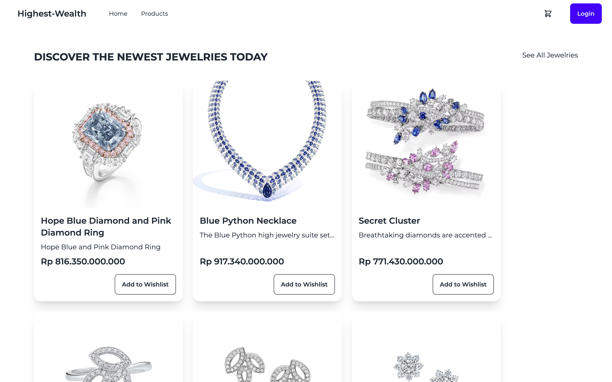
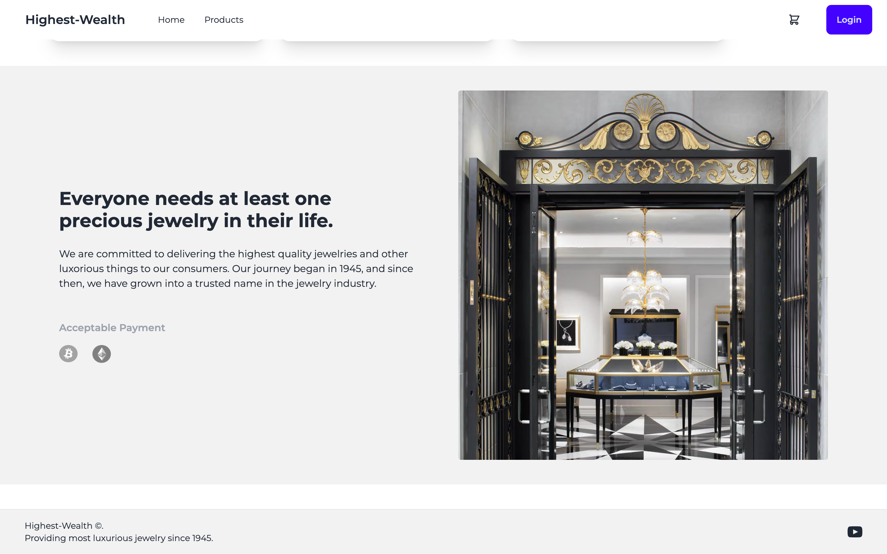
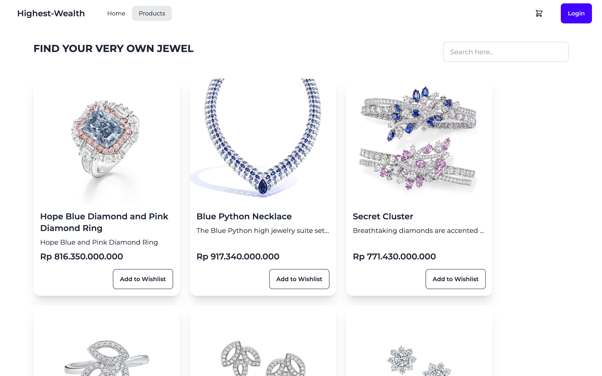
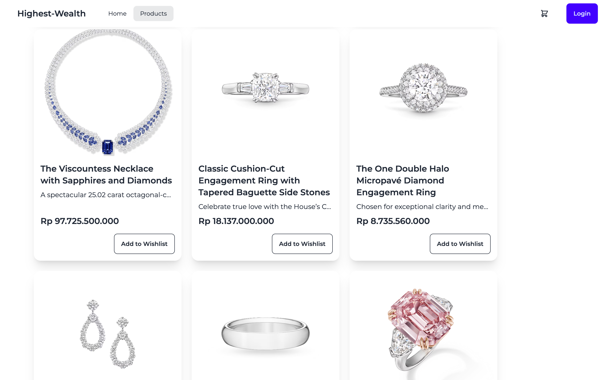
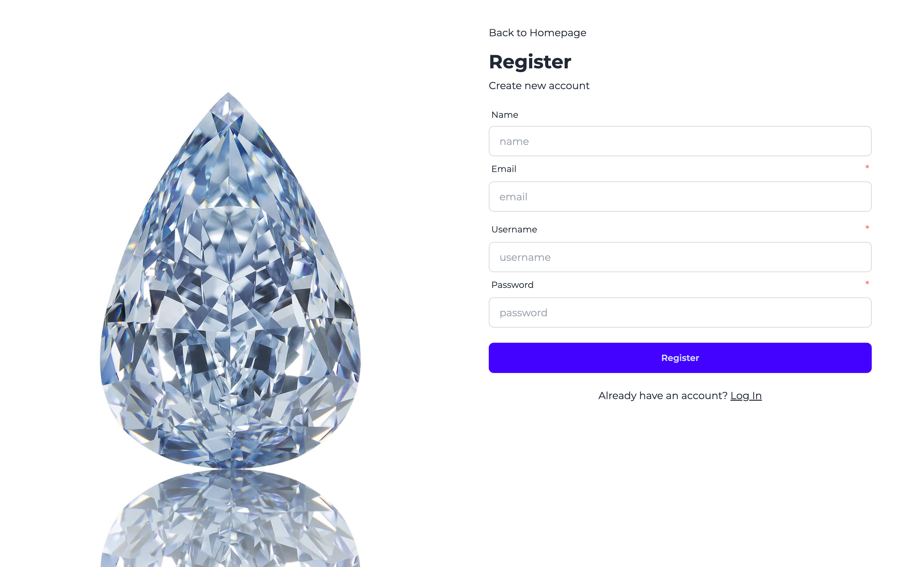
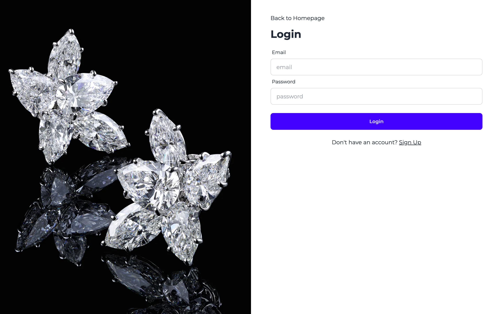
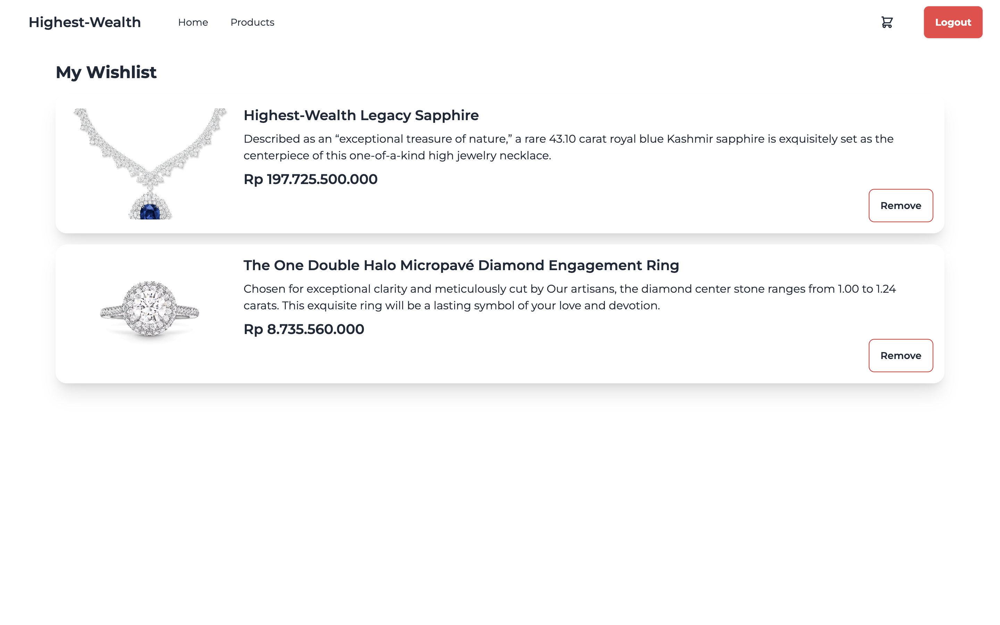
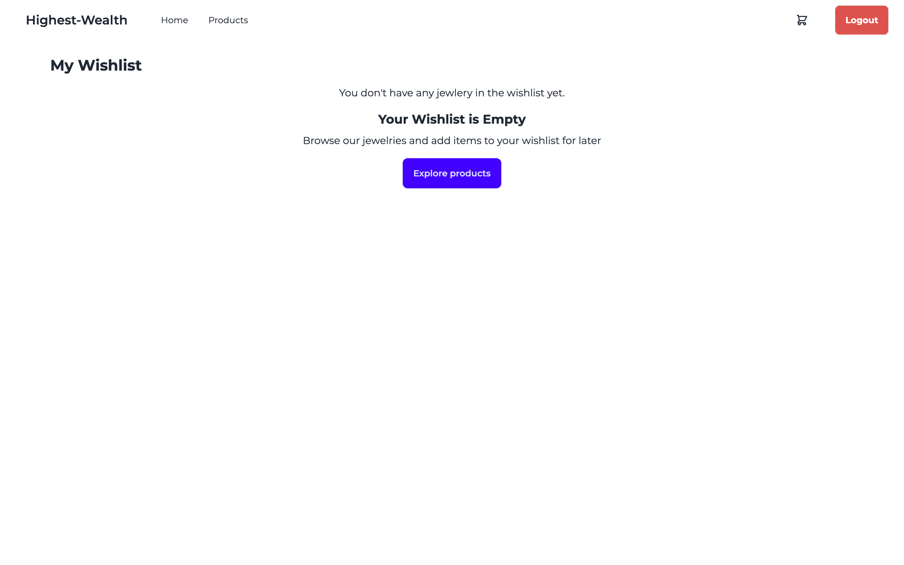

# Highest-Wealth

An online store built with Next.js for selling products, for this one, the theme is jewelry.

## Table of Contents

- [Highest-Wealth](#highest-wealth)
  - [Table of Contents](#table-of-contents)
  - [Introduction](#introduction)
    - [Demo](#demo)
  - [Features](#features)
  - [Tech Stack](#tech-stack)
  - [Installation](#installation)
    - [Prerequisites](#prerequisites)
    - [Prerequisites 2](#prerequisites-2)
    - [Setup Instructions](#setup-instructions)
  - [Screenshots](#screenshots)
    - [Homepage](#homepage)
    - [Homepage 2](#homepage-2)
    - [Homepage 3](#homepage-3)
    - [Products Page](#products-page)
    - [Products Page 2](#products-page-2)
    - [Register Page](#register-page)
    - [Login Page](#login-page)
    - [Wishlist Page](#wishlist-page)
    - [Empty Wishlist Page](#empty-wishlist-page)
  - [Contact Information](#contact-information)

## Introduction

This e-commerce website allows users to browse products, add them to the wishlist. The goal is to provide a seamless shopping experience.

### Demo

- Deployed Demo: <https://highest-wealth.vercel.app/>
- Registered User 1: <dadit@mail.com> | 1234567
- Registered User 2: <monica@mail.com> | 1234567

## Features

- Product browsing with search and filtering.
- User authentication and authorization.
- Wishlist functionality.

## Tech Stack

- **Frontend:** Next.js, Tailwind CSS
- **Backend:** Next.js (for API routes), Node.js, MongoDB
- **Database:** MongoDB

## Installation

### Prerequisites

- Node.js
- MongoDB

### Prerequisites 2

Set up your .env file with the following variables:

```env
MONGODB_URI=your_mongodb_uri
JWT_SECRET=your_jwt_secret
NEXT_PUBLIC_BASE_URL=your_next_public_base_url
```

### Setup Instructions

```bash
git clone https://github.com/daditsan/highest-wealth.git
cd highest-wealth
npm install
npm run dev
```

Access the website at <http://localhost:3000>

## Screenshots

### Homepage


### Homepage 2



### Homepage 3



### Products Page



### Products Page 2



### Register Page



### Login Page



### Wishlist Page



### Empty Wishlist Page



## Contact Information

For any questions or concerns, reach out to me at <dityaisanda@gmail.com>
